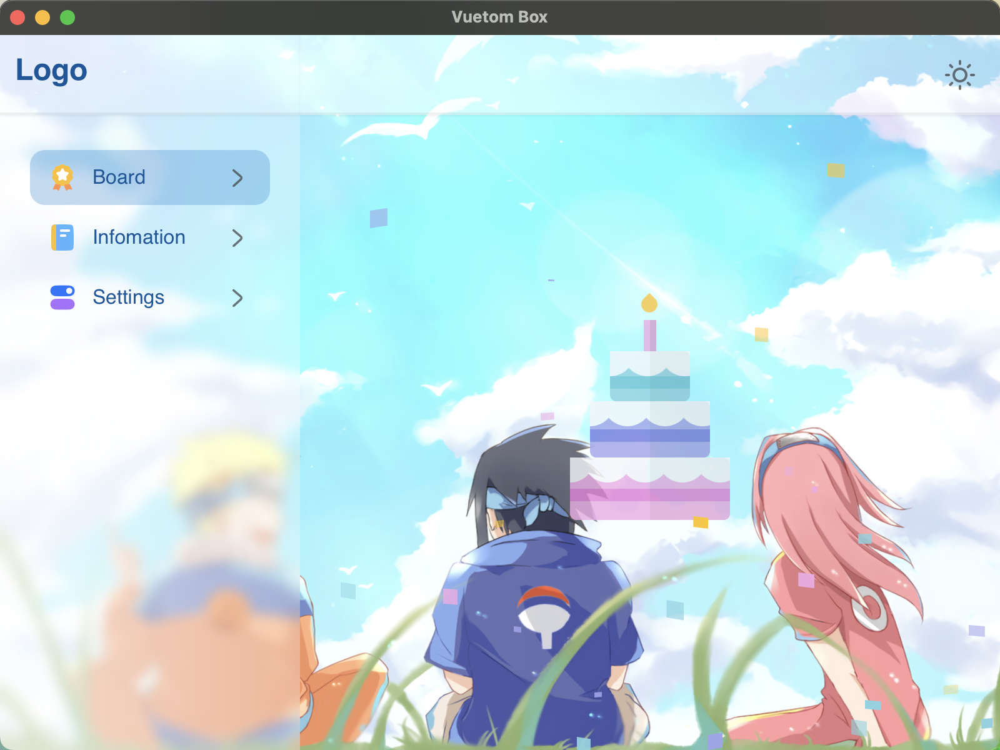
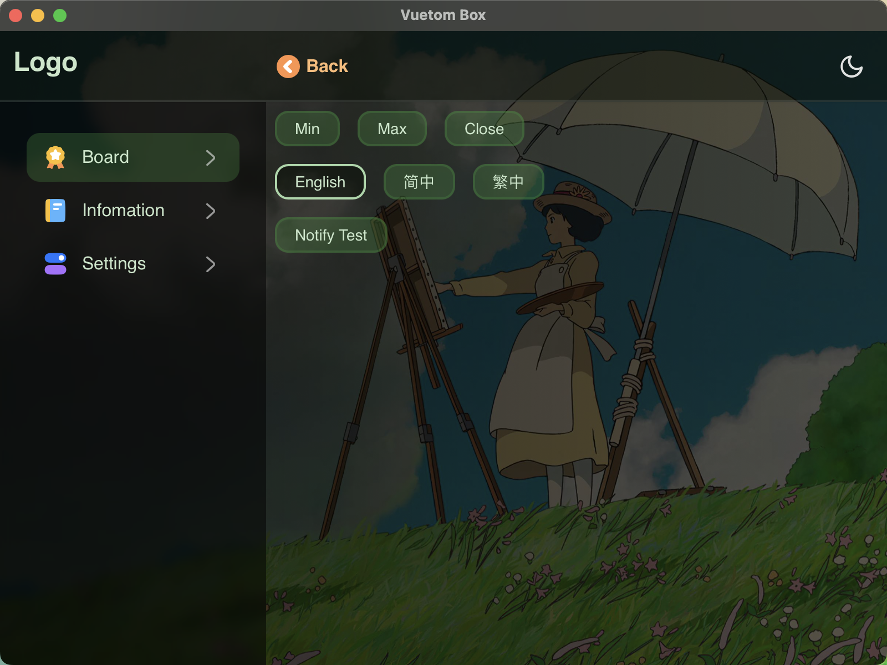
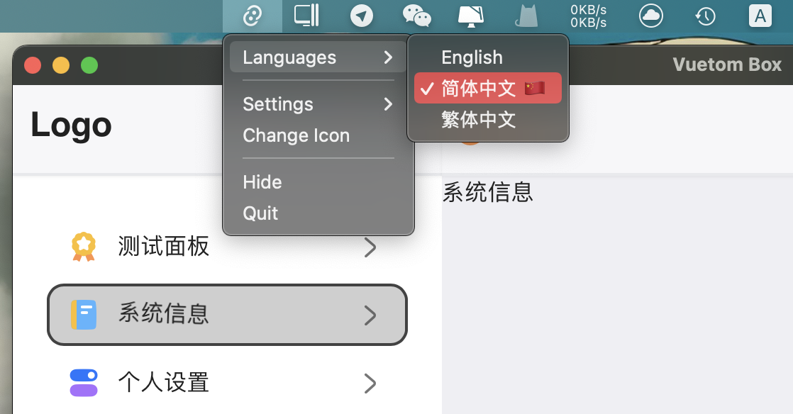
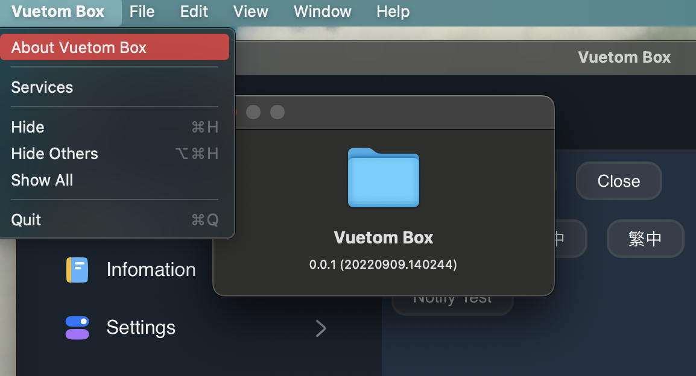

# Tauri - Vuetom Box

Rust + Vue3 + Vite + Ts + Tailwind

App volume after packaging: 11911299 bytes (**11.9 MB**)

App directory after packaging: `src-tauri/target/release/bundle`

## 项目

tauri:

- src:
  - main.rs
  - lang.rs
  - menu.rs
  - tray.rs
  - winv.rs
  - events
    - mod.rs
    - system.rs

### 多语言

可从托盘或页面设置中切换语言 en, zh, zhHK

### 主题

三种主题与主题亮暗模式适配 (normal, naruto, wind)

### 暗黑模式

tailwind: `dark: 'class'`

```scss
button {
  @apply hover:bg-opacity-50 active:bg-opacity-100 ...;
  // light
  @apply bg-green-400 bg-opacity-30;
  // dark
  @apply dark:bg-blue-800 dark:bg-opacity-60;
}
```

scss var

```scss
// light
:root {
  --vt-c-bg: #fff;
}
// dark
.dark {
  --vt-c-bg: #000;
}
// use
.root {
  background-color: var(--vt-c-bg);
}
// Deprecated media
// @media (prefers-color-scheme: dark) {
//   :root { }
// }
```

## 操作

**npm 脚本**

```sh
# 安装依赖
pnpm install

# 浏览器中打开
pnpm dev

# 操作系统预览
pnpm tauri:dev

# 打包应用
pnpm tauri:build
```

**cargo 脚本**

```sh
cd src-tauri/

cargo add lib

cargo fmt
```

## Rust

总结中...

## 功能

- [x] 响应式菜单
- [x] 主题与亮暗模式
- [x] 多语言
- [x] 简单事件交互
- [ ] 内置服务器
- [ ] 弹框组件
- [ ] 更多动效

## 初版预览










## 链接

[Tauri](https://tauri.app/v1/guides/getting-started/setup)

[script setup docs](https://v3.vuejs.org/api/sfc-script-setup.html#sfc-script-setup)

[rust-analyzer](https://marketplace.visualstudio.com/items?itemName=rust-lang.rust-analyzer)
